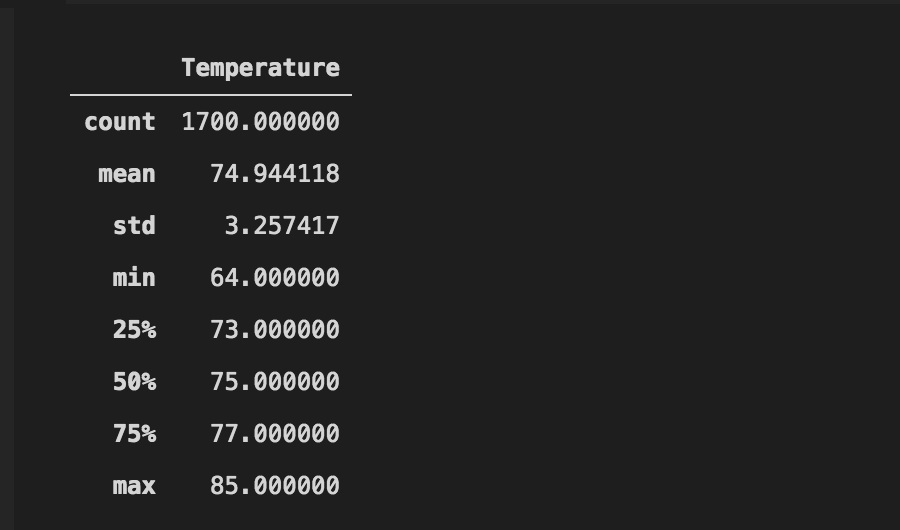
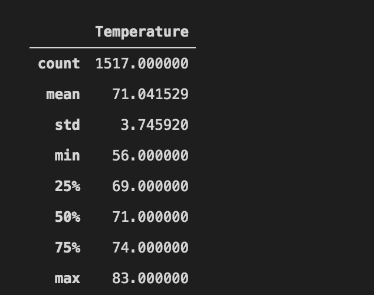

# Surfs Up Analysis
The purpose of this analysis was to compare the weather data from June and December, to see if a business could be sustainable year round.
## Results
* The data shows that the temperatures are lower on average in December than June, as shown below. The difference, however, is slight, which is good news, as it means that the business should work in both seasons.
* We do however see that the variance is greater during December, which might indicate that some days could be better than others.
* Lastly, we see that the highest recorded temperature in December is only two degress less than in June, which strengthens the case for a year round shop.

## Summary
The dataset gives us a clear indication that the business would be sustainable year round. The difference between June and December is slight enough that, while business might be slower during the winter months, there should be ample time for surfing year round.
